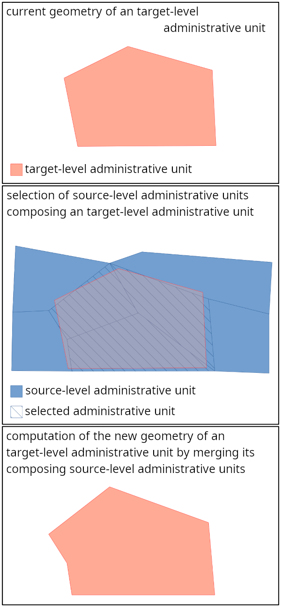

# Introduction

La présente documentation, à destination des développeurs, a pour objectif de présenter le détail du fonctionnement du processus de dérivation des unités d'un échelon administratif donné à partir des unités d'un échelon inférieur qui les composent.

# Installation

## Code source 

Le code source de l'application est disponible sur le dépôt [au_merging](https://github.com/openmapsforeurope2/au_merging.git)

## Dépendances 

L'installation de l'application nécessite la compilation préalable de bibliothèques internes et externes à l'IGN.

Voici le graphe des dépendances :

### Socle IGN 

Le socle logiciel de l'IGN regroupe un ensemble de bibliothèques développées en interne qui permettent d'unifier l'accès aux bibliothèques c++ de traitement et de stockage de données géographiques.
On y trouve notamment des modèles de données pivots (géométries, objet attributaire), des fonctions de lecture/écriture de conteneurs d'objets, des opérations sur les géométries, de nombreux algorithmes et outils spécifiquement conçus pour répondre à des problématiques géomaticiennes...

Le code source du socle ce trouve sur le dépôt [sd-socle](http://gitlab.forge-idi.ign.fr/socle/sd-socle.git)

### LibEPG 

Cette bibliothèque, développée à l'IGN et s'appuyant essentiellement sur le socle logiciel, contient de nombreux algorithmes et fonctions utilitaires dédiés spécifiquement aux besoins des produits européens (EGM/ERM) ainsi qu'au projet [OME2](https://github.com/openmapsforeurope2/OME2).
Elle comporte essentiellement des fonctions de généralisations, des fonctions utiles au management du processus tels que des utilitaires de log, d'orchestration, de gestion du contexte.
On y trouve également des opérateurs permettant d'encapsuler des objets géométriques complexes afin d'en optimiser la manipulation (par l'utilisation de graphes, d'indexes...) et ainsi d'accroitre les performances globales des processus.

Le code source de la bibliothèque libepg ce trouve sur le dépôt [libepg](https://github.com/IGNF/libepg.git)

# Fonctionnement du processus

Le traitement de dérivation des surfaces administratives est lancé pour un pays. 
Cet outil doit être utilisé sur des tables de travail dans lesquelles sont extraites les unités administratives à traiter.
Si l'on désire ne dériver qu'un sous-ensemble des unités administratives frontalières d'un pays (par exemple, celles bordant un ou plusieurs pays frontaliers particuliers), il suffit de n'extraire dans la table travail que les surfaces que l'on souhaite traiter.
Après lancement du processus __au_matching__ sur les surfaces frontalières du plus petit échelon administratif du pays traité, le présent processus doit être lancé sur les échelons supérieurs afin de propager le travail de mise en cohérence aux frontières réalisé à l'échelon le plus petit vers les autres échelons.
A noter que l'échelon le plus petit est celui possédant le rang le plus haut (pouvant aller jusqu'à de 1 à 6 selon le pays). L'échelon le plus haut possède le rang 1, il correspond à l'emprise nationale.
Les échelons sont dérivés de manière séquentielle et ordonnée en partant du deuxième plus petit niveau administratif pour aboutir au niveau le plus élevé. Pour des raisons d'efficacité un échelon administratif sera dérivé de l'échelon inférieur le plus proche (afin de minimiser le nombre de surfaces à aggréger). Il faut que le niveau administratif supérieur soit compatible avec le niveau inférieur, c'est à dire que les surfaces du niveau supérieur soient composées de surfaces du niveau inférieur. En effet, les surfaces de l'échelon N peuvent ne pas être une aggrégation de surfaces de l'échelon N+1, mais de surfaces d'un échelon encore inférieur.

## Configuration

L'outil s'appuie sur de nombreux paramètres de configuration permettant d'adapter le comportement des algorithmes en fonctions des spécificités nationales (sémantique, précision, échelle, conventions de modélisation...).

On trouve dans le [dossier de configuration](https://github.com/openmapsforeurope2/au_merging/tree/main/config) les fichiers suivants :

- epg_parameters.ini : regroupe des paramètres de base issus de la bibliothèque libepg qui constitue le socle de développement l'outil. Ce fichier est aussi le fichier chapeau qui pointe vers les autres fichiers de configurations.
- db_conf.ini : informations de connexion à la base de données.
- theme_parameters.ini : configuration des paramètres spécifiques à l'application.

## Lancement du traitement

L'outil s'utilise en ligne de commande.

Paramètres :

* c [obligatoire] : chemin vers le fichier de configuration
* s [obligatoire] : suffix de la table de travail
* sl [obligatoire] : niveau administratif source
* tl [obligatoire] : niveau administratif cible
* argument libre [obligatoire] : code pays

 

Exemples d'appel:

~~~
bin/au_merging --c path/to/config/epg_parmaters.ini --tl 2 --sl 1 --s 20260526 fr
~~~

## Fonctionnement détaillé

#### Données de travail :

| table                          | entrée | sortie | description                                                          |
|--------------------------------|--------|--------|----------------------------------------------------------------------|
| TARGET_BOUNDARY_TABLE          | X      |        | table des frontières                                                 |
| SOURCE_TABLE                   | X      |        | table de l'échelon administratif source (< échelon cible)            |
| COAST_TABLE                    | x      | x      | table de travail contenant les surfaces de l'échelon cible à traiter |

#### Principaux opérateurs de calcul utilisés :
- app::calcul::AuMergingOp

#### Description du traitement :
Paramètre utilisés: 
| paramètre                       | description                                                                                     |
|---------------------------------|-------------------------------------------------------------------------------------------------|
| SLIM_SURFACE_WIDTH              | largeur minimum pour qu'un contour de forme logiligne ne soit pas considéré comme un artefact   |
| SMALL_SURFACE_AREA              | aire minimum définie par un contour pour que ce contour ne soit pas considéré comme un artefact |    
| SNAP_TOLERANCE                  | distance d'accrochage entre les surfaces sources aggrégées                                      |

On parcourt toutes les surfaces administratives de l'échelon administratif cible. Pour chacune de ces surfaces on parcourt les surfaces de l'échelon source avec lesquelles elle est en contact. On calcule l'intersection de chacune de ces surfaces sources avec la surface cible. Pour qu'une surface source soit considérée comme une composante de la surface cible il faut que l'aire de leur intersection soit supérieure à 90% de l'aire la surface source.
La nouvelle géométrie de la surface cible est calculée en aggrégeant les surfaces sources composant la surface cible. Chaque surface source est accrochée avant fusion à la surface aggrégée afin d'éviter la création d'éventuels artefacts (trous fins). 
Afin de vérifier qu'aucun artefact n'a été généré lors de la fusion, on contrôle l'ensemble des contours de la surface fusionnée. Si un contour est detecté comme étant 'fin', c'est à dire de forme longiligne et de largeur inférieure à _SLIM_SURFACE_WIDTH_, ou s'il délimite une surface dont l'aire est inférieure à _SMALL_SURFACE_AREA_, un message est inscrit dans le fichier de log. Il reviendra à l'utilisateur de vérifier la présence de tels messages dans le fichier de log, et, de vérifier, le cas échéant, si des artefacts sont bien présents.

